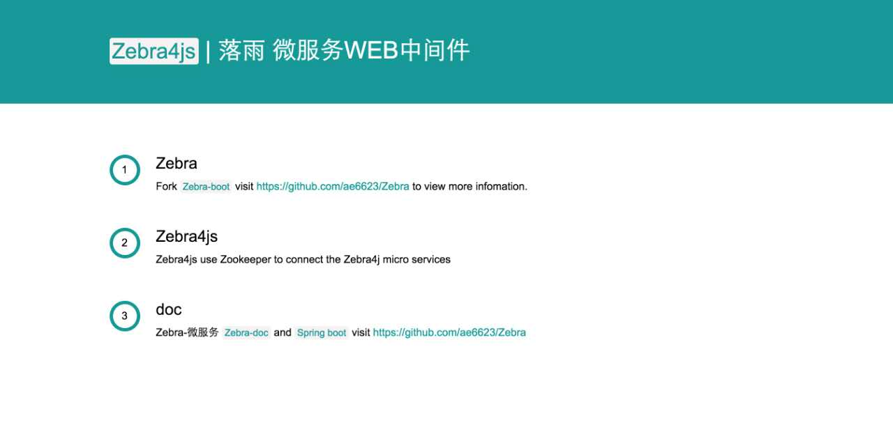
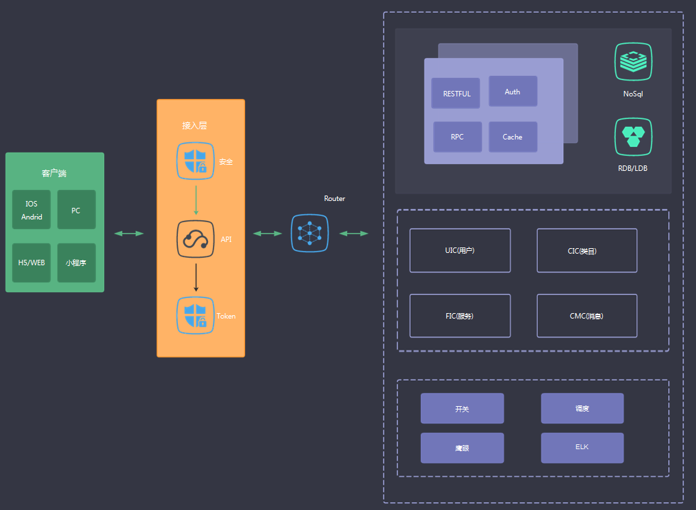

## Introduction 介绍
[![Gitter][badge-gitter-img]][badge-gitter] [![Build Status][badge-travis-img]][badge-travis] ![][zebra] ![][maven]

GitHub地址：[https://github.com/ae6623/Zebra](https://github.com/ae6623/Zebra)

OSCGit地址：[http://git.oschina.net/ae6623/Zebra](http://git.oschina.net/ae6623/Zebra)

zebra-design

`Zebra4J`是一款使用`Sping Boot`特性全新开发的微服务`WEB`框架，尝试封装一些常用框架比如`dubbo`等作为`spring-boot`组件，结合微服务的框架思想，利用`NodeJs`、[Zebra4Js](https://github.com/ae6623/Zebra/tree/master/zebra4js)作为应用网关，使得各个功能分层服务，持续迭代，解放团队生产力，快速构建`企业级`Web 应用。

## Frameworks and Tools 构建
* Java&IDE: JDK8 Lamda/Intellij Idea 16
* Backend:  SpringBoot Docker Zookeeper (Configured by annotation/app)
* Database: Mysql/MongoDB/Redis
* Cache:Memcached/Redis
* Web Server: Nginx/Tomcat 7
* Build Tool: Maven
* Other: Commons-Dbcp2(database connection pool) JUnit sl4j Jackson FastJson
* Zebra4J  Port:http://localhost:8888
* Zebra4Js Port:http://localhost:8360

## 项目介绍
* 1.如何启动
	* Zookeeper集群，3台即可，也可以搭建伪集群，一台机器，解压多个Zookeeper分别放在三个目录，端口号不同即可，核心配置文件在[zoo.cfg](https://github.com/ae6623/Zebra/blob/master/zebra4j/zebra-zookeeper/zoo.cfg)。
	* 服务端`Zebra4j`是基于SpringBoot的注册服务端的一个Demo，当多个提供Api的微服务启动，将自动寻找Zookeeper并注册所有的Controller请求映射。
	* 网关端`Zebra4js`是基于Nodejs的微服务服务发现，用来作为网关层，对前端请求进行接收，并调用Zookeeper，获取真实的微服务Api接口地址，进行请求，并返回到前端结果。	 	

## About 关于落雨
* [Github-Me](https://github.com/ae6623)
* [Linkedin-Me](http://www.linkedin.com/in/ae6623)
* [QQ:43163707]()
* [微信:ae6623]()
* [Js-dev.cn](http://js-dev.cn)

* 详细项目文档持续更新中，也欢迎各位达人提交PR，一起为China🇨🇳开源项目添砖增瓦，`Zebra4J`、`Zebra4Js`文档请参阅 [Zebra-doc/Zebra-微服务.md](https://github.com/ae6623/Zebra/blob/master/zebra4j/zebra-doc/zebra-boot/Zebra-%E5%BE%AE%E6%9C%8D%E5%8A%A1.md)

[badge-gitter-img]:       https://badges.gitter.im/hsz/idea-gitignore.svg
[badge-gitter]:           https://gitter.im/hsz/idea-gitignore
[badge-travis-img]:       https://travis-ci.org/hsz/idea-gitignore.svg
[badge-travis]:           https://travis-ci.org/hsz/idea-gitignore
[zebra]:				  https://img.shields.io/badge/zebra-fast-orange.svg
[maven]: 				  https://img.shields.io/maven-central/v/org.apache.maven/apache-maven.svg

## License 许可协议

* [MIT](https://github.com/ae6623/Zebra/blob/master/LICENSE)
